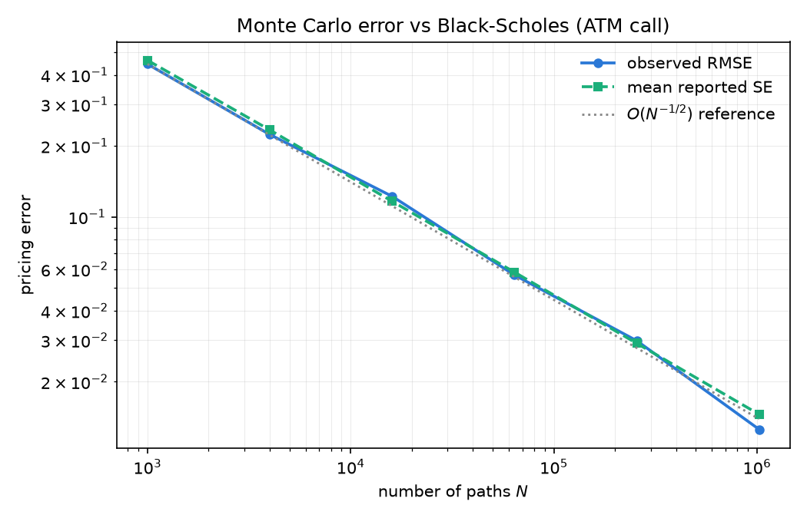
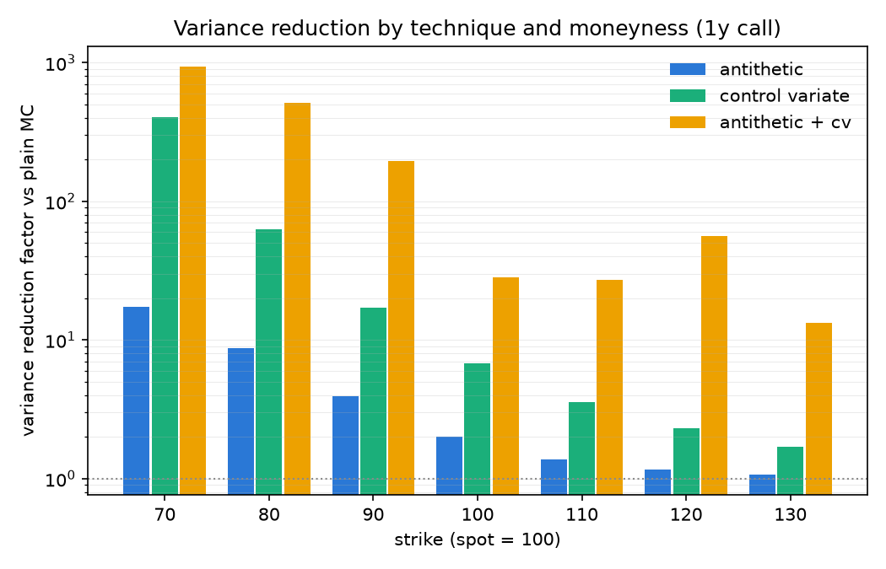

# qpricer

A Python library for pricing European vanilla options with multiple numerical
methods, quantifying their accuracy against the Black–Scholes closed form, and
benchmarking their performance.

Built as a study of how the standard pricing methods trade accuracy for
compute: every claim below is reproducible from a committed script, every
estimator is tested against the closed form, and the performance work is
profiling-driven rather than speculative.

## Install

```bash
pip install -e .                        # core: numpy only
pip install -e ".[perf,analysis,dev]"   # numba kernels, plots, test tooling
```

## Quickstart

```python
from qpricer import EuropeanOption, MarketData, OptionType, bs_price, crr_price, mc_price

market = MarketData(spot=100.0, rate=0.05, vol=0.2, dividend_yield=0.01)
call = EuropeanOption(strike=105.0, maturity=1.0, option_type=OptionType.CALL)

bs_price(call, market)  # 7.4917 (closed form)
crr_price(call, market, steps=1000)  # 7.4915 (binomial tree)
res = mc_price(call, market, n_paths=1_000_000, seed=42)
res.price, res.std_error  # (7.4954, 0.0127)
res.confidence_interval()  # (7.4706, 7.5203)
```

`python examples/quickstart.py` runs the full tour, including implied
volatility and variance-reduced Monte Carlo.

## Methods

| method | error vs closed form | cost driver | when it wins |
|---|---|---|---|
| Black–Scholes (`bs_price`) | exact | O(1) | always, when a closed form exists |
| CRR binomial (`crr_price`) | O(1/steps) | O(steps²) node updates | small trees, deterministic error |
| Monte Carlo (`mc_price`) | O(N^-1/2) statistical | O(N) paths | no closed form / path-dependence (out of scope here), error bars for free |

Everything is seeded (`numpy.random.default_rng`), so all results below are
exactly reproducible.

## Results

### 1. How close is Monte Carlo to Black–Scholes?

For an ATM 1y call (S=100, K=100, r=5%, σ=20%, BS price 10.4506), plain MC with
a fixed seed lands within its reported confidence interval of the closed form.
The observed RMSE across 30 independent runs matches the estimator's own
reported standard error and decays as O(N^-1/2):

| paths | RMSE | mean reported SE |
|---|---|---|
| 1,000 | 0.4449 | 0.4617 |
| 16,000 | 0.1223 | 0.1165 |
| 256,000 | 0.0298 | 0.0291 |
| 1,024,000 | 0.0126 | 0.0146 |



### 2. How many simulations for 1% error?

**≈ 20,000 paths** bring the standard error of the ATM call under 1% of its
price (pilot-run estimate: 19,751; see `qpricer.mc.convergence.paths_for_relative_error`).
The quadratic cost of accuracy: 0.5% error needs 4× that, 0.1% needs 100×.

Reproduce with `python scripts/run_convergence.py`.

### 3. How much faster is Numba than plain NumPy?

The numba kernels fuse exp, payoff and accumulation into one allocation-free
pass over pre-drawn normals (median of 7 runs, JIT warm-up excluded, WSL2;
NumPy column is after the profiling-driven in-place optimization; see
`reports/profiling.md`):

| paths | NumPy | numba | numba speedup | numba_parallel speedup |
|---|---|---|---|---|
| 100,000 | 3.1 ms | 2.2 ms | 1.4× | 2.0× |
| 1,000,000 | 35.6 ms | 21.8 ms | 1.6× | 2.6× |
| 10,000,000 | 316.4 ms | 155.2 ms | 2.0× | 2.5× |

All backends share the NumPy random draws, which cost roughly a third of the
NumPy runtime, creating an Amdahl's-law ceiling on the achievable speedup. Parallelism
only pays around ~1M paths and above; below that, thread startup dominates and
small-N timings are noisy. Optimizing the NumPy path (10M: 386 → 315 ms by
removing temporary allocations) narrowed numba's edge from 2.4× to 2.0×: both
attack the same memory-traffic problem, by fusion or by in-place ufuncs.

Reproduce with `python benchmarks/bench_mc.py`.

### 4. How effective are variance reduction techniques?

Variance reduction factor vs plain MC at equal path count (400k paths, 1y
calls; a factor of R means plain MC needs R× more paths for the same error):

| strike | antithetic | control variate | antithetic + CV |
|---|---|---|---|
| 70 (deep ITM) | 17.3× | 406× | 942× |
| 100 (ATM) | 2.0× | 6.8× | 28× |
| 130 (deep OTM) | 1.1× | 1.7× | 13× |



Both techniques exploit the payoff's near-linearity in S_T, so they shine ITM
(the terminal-spot control absorbs almost all variance) and fade OTM, where
the payoff is dominated by its nonlinear kink. Note the factors are themselves
noisy estimates, since single-seed values for the combined technique wobble in the
OTM tail.

Reproduce with `python scripts/run_variance_reduction.py`.

## Project structure

```
src/qpricer/
├── instruments.py            EuropeanOption + payoffs
├── market.py                 MarketData (spot, rate, vol, dividend yield)
├── analytic/
│   ├── black_scholes.py      prices, all first-order Greeks
│   └── implied_vol.py        Newton + bisection fallback, no-arbitrage bounds
├── tree/binomial.py          CRR: loop reference + vectorized induction
└── mc/
    ├── engine.py             seeded GBM MC, batching, backend selection
    ├── variance_reduction.py antithetic / control variate / combined
    ├── numba_kernels.py      optional fused JIT kernels (serial + prange)
    └── convergence.py        error studies, paths-for-target-error
scripts/                      report generators (reports/ holds their output)
benchmarks/                   timing harness + cProfile driver
tests/                        189 tests: parity properties, FD Greeks checks,
                              statistical 3σ tests, kernel equivalence
```

## Correctness approach

- **Closed form as ground truth**: MC and tree prices are tested against
  Black–Scholes, both statistically (within 3 SE) and by convergence rate.
- **Properties, not just examples**: put–call parity holds as a hypothesis
  property; Greeks match central finite differences; implied vol round-trips
  across a moneyness/maturity/vol grid.
- **Reference implementations**: the vectorized tree must match its explicit
  loop version to 1e-12; numba kernels must match the NumPy engine on shared
  random draws.

## Development

```bash
pip install -e ".[dev,perf,analysis]"
pytest                  # test suite
ruff check . && ruff format --check .
mypy src                # strict mode
```

CI runs lint, strict type-checking and the test matrix (3.11/3.12) on every
push.
